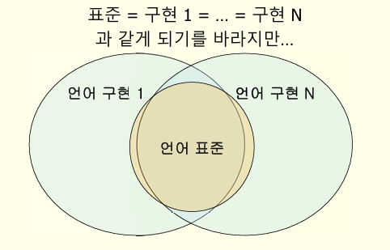

# 프로그래밍 언어론

# 🌟PL design issue

## 프로그래밍 언어의 역할

- 사람과 기계의 의사소통
- 사람과 사람의 의사소통
- 프로그래밍 숙련도, 가독성의 중요성

## 언어 학습 이유

- 자연어 : 의사소통
- 프로그래밍 언어: 프로그램 작성을 위해(컴퓨터가 알아듣도록, 다른 사람이 이해하도록)
- 효과적인 알고리즘 개발
- 프로그래밍 언어의 효과적 사용
- 유용한 프로그래밍 요소 사용
- 더 적합한 언어 선택
- 새로운 언어 배우기
- 새로운 언어를 쉽게 설계

## 프로그래밍 언어의 분류 기준

- 문제 영역(사무응용, 과학계산, 인공지능, 시스템 프로그래밍, 웹)
- 패러다임(프로그램을 하는 스타일)
    - 절차언어
    - 함수형 언어
    - 모듈 기반 언어
    - 객체 지향 언어
    - 지네릭 프로그래밍
- 계산 모델
    - 명령형 언어(폰노이만 구조 기반)
    - 함수형 언어(순환 함수 이론 기반)
    - 논리 언어(연역 논리 기반)

## 프로그래밍 변천사

- batch(하나의 프로세스만 실행)
- time sharing
- pc(미니 컴퓨터, 마이크로 컴퓨터)
- web

## 좋은 언어의 조건

- 명료성, 간결성, 일관성
- 직교성 (모든 가능한 조합이 다 이루어지나)
- 응용 분야 지원 (필요한 것을 지원하도록, 없으면 만들 수 있도록)
- 추상화 지원
- 테스트의 용이성
- 프로그래밍 환경
- 이식성 (지원하는 플랫폼이 다양한가)
- 비용

## PL 비용

- 개발하고 관리하는데 드는 비용
- 수행비용, 번역비용, 작성비용, 관리비용

## PL 패러다임

- 패러다임 : a general model for problem solving
- 패러다임과 계산 모델은 밀접한 관련이 있지만 일대일 대응은 아님
    - 객체지향 패러다임은 보통 명령어 언어 지원하지만 함수형 언어로 지원 가능
    
    ### 명령형 언어 : imperative
    
    - 계산 모델
        - 절차 언어
        - 폰노이만 아키텍처 (상태 전이 기계)
    - ex) FORTRAN, COBOL, C, PASCAL
    
    ### 함수형 언어 : functional
    
    - 계산 모델
        - 함수형 언어 (applicative language)
        - 입력값을 받아서 출력값을 내는 함수
        - 변수도 없고 대입 연산도 없음
    - 함수 합성이 주요 수단
        - ex) LISP, Scheme, ML, HASKELL
    
    ### 규칙기반 언어 : rule-based
    
    - 계산 모델
        - 논리 언어
        - 입력 : 명제의 조합
        - 출력 : 추론 결과
    - ex) Prolog
    
    ### 객체지향 언어 : object-oriented
    
    - 계산 모델
        - 객체들의 움직임
        - 주로 명령형 패러다임의 언어에 구현됨
    - 특징
        - 유일한 identity를 갖는 객체들로 구성
        - 객체는 property, behavior 가짐
        - property : data로 구현
        - behavior : method로 구현
        - 객체는 class의 instance
    - ex) smalltalk, c++, java

## 구조화 프로그래밍

- 모든 흐름 제어 구조 세가지
    - 순차 구조
    - 선택 구조
    - 반복 구조
- 하향식 설계
- 프라임 프로그램 : single entry, single exit

## 언어 표준과 언어 구현

- 언어 표준 : 문서 언어 설계도
- 언어 구현 : 컴파일러(번역기), 인터프리터
- 표준화 기구 : ISO, IEEE, ANSI



### 국제화 (I18N)

- 문자 세트 : ASCII → UNICODE
- 날짜, 시간, 통화 단위

## 프로그래밍 환경

- 프로그램 작성, 테스트에 사용되는 환경
- 언어 사용층에 영향
- 언어 설계에 영향
    - **분리 컴파일**
        - 공유되어야 하는 정보
            - 서브 프로그램 호출 정보
            - 공유 되는 변수 타입
            - 공동으로 사용할 타입의 정의
        - 지원 방법
            1. 필요한 것 다시 선언
            2. 특정 순서로 컴파일
            3. 라이브러리 형태로 참조
        - 용어 구분
            - 분리 컴파일 : 인터페이스 정보 필요로 할 수 있음
            - 독립 컴파일 : 각 컴파일 단위가 독립적 ( 1 )
    - **테스트 및 디버깅**
        - 지원 방법
            - 실행 순서 따라가기 (execution trace)
            - 중단점 설정 ( breakpoints)
            - 조건 검사 (assertion)

---

# 🌟 Impact of machine architectures

## computer

- 정의
    - 프로그램 실행 시에 사용하는 알고리즘과 자료구조를 computer라고 정의한다
    - actual computer (hw)
    - software-simulated computer : 컴퓨터 상의 소프트웨어로 구성된
- 6 components
    
    
    |  | 프로그래밍 언어 관점 | hw 관점 |
    | --- | --- | --- |
    | Data | 자료와 자료구조 | - 3개의 저장장치
    - 내장 자료형 (정수, 소수 …) |
    | Primitive Operation | 기본 연산 | - 수식 계산, 자료 파악, 입출력 제어, 수행 제어 연산 (기계어)  |
    | Sequence Control | 기본 연산 수행 메커니즘 | - 다음 명령어 선정
    - 명령어 수행 cycle |
    | Data Access | 자료 제어 메커니즘 | - 피연산자 access
    - 결과의 저장 위치 결정 |
    | Storage Management | 메모리 할당 제어 | - cpu, 메모리 처리속도 극복을 위한 저장소 관리 |
    | Operating Environment | 외부 환경과의 통신 메커니즘 | - 외부장치 (IO)와의 통신 수단 |

## Machine cycle

- Fetch - execute cycle
    - fetch - decode - execute

## Firmware Computers

- 하드웨어 + 마이크로 프로그램
- firmware : 하드웨어에 저장된 마이크로 프로그램
- emulation : 소프트웨어적으로 마이크로 프로그램 수행 흉내

## Translator

- high level language을 컴퓨터에서 실행
- translation (compilation)
    - 고급언어 → 기계어
    - assembler, compiler, loader, linker …
- software simlation (interpreter)
    - 다른 컴퓨터에서 실행되는 프로그램을 이용하여 동작
    - 프로그램을 입력으로 받아 입력된 프로그램의 각 문장을 해석해서 결과 생성

## virtual computer

- 언어 구현 (translater)에 의하여 정의 된 것을 virtual computer라고 한다.
- virtual computer의 기계어는 언어 번역기에 의해 실행 가능한 프로그램
- 구현된 프로그래밍 언어는 그 자체로 가상 기계
- 응용 프로그램 작성 시 사용하는 가상 기계들은 계층을 이룸

## 언어 구현의 차이 발생 이유

1. 가상 기계에 대한 개념적 차이
2. 구현 플랫폼의 차이
3. 구현 방법의 차이

## 바인딩

- 정의 : 묶음, 프로그램 구성 요소와 속성(properties)의 묶음
- 바인딩 시각 : 언어 구성 요소마다, 속성에 따라 다름
    
    ### **static binding (early binding)**
    
    1. 언어 정의 시점 : 설계하는 시점
    2. 언어 구현 시점
    3. 프로그램 번역 시점
    4. 링크 시점
    5. 로드 시점 : 메모리에 올리는 시점
    - 결과
        - 번역 전에 파악할 수 있는 정보가 많음
        - 실행 파일 효율 높이는 번역이 가능
        - compilation 방법과 잘 어울림
    
    ### **dynamic binding (late binding)**
    
    1. 프로그램 수행 시점
    - 결과
        - 유연한 프로그래밍
        - interpretation방법과 잘 어울림
        - 코드 수정 용이
    - ex) c언어에서
        
        ```c
        static int X;
         scanf("%d", &X);
         X = X + 10;
        ```
        
        | 변수의 가능한 타입 | 1 |
        | --- | --- |
        | 변수의 타입 | 3 |
        | 변수의 값 | 6 |
        | +의 일반적 의미 | 1 |
        | 위 +의 의미 (정수해인지 실수해 덧셈인지) | 3 |
        | 숫자 10의 의미 | 1 |
        | 숫자 10의 내부 표현 형태 | 2 |
        | scanf 호출 시 수행될 내용 | 4 |
        | 변수 x의 주소 | 5 |
        

---

# 🌟Language Translation Issues

## 구문과 의미

- 프로그래밍 언어 = 구문 + 의미

### 구문(Syntax)

- 제대로 생긴 프로그램에 대한 규정
    - readability
    - writeability
    - ease of verifiability
    - ease of translation
    - lack of ambiguity
- 표준적 구문 표기법
    - BNF (backus-naur form)
    - EBNF (extended bnf)
    - CFG (context-free grammar)

### 의미 (Semantics)

- 어떤 동작을 하는 가에 대한 규정
    - execution behavior
- 의미 표기법
    - axiomatic semantics
    - denotational semantics
    - operational semantics
- static semantics
    - CFG로 나타낼 수 없는 범위의 구문 규정
    - attribute grammar로 표현

## 번역 과정

1. 분석 (analysis)
2. 종합 (synthesis) - 최적화, 코드 생성


### 번역 각 단계

- 어휘 분석 (lexical analysis)
    - 프로그램을 단어로 나눔
    - 주석 제거
- 구문 분석 (syntax analysis ; parsing)
    - tree로 표현
- 의미 분석 (semantic analysis)
    - 정적 의미 분석 (타입 검사 포함)
    - symbol table 체크해서 분석

— 머신 코드 보다 상위 레벨의 중간 코드가 만들어짐 —

- 코드 생성 (code generation)
    - tree로 부터 수행 가능한 코드 생성
- 최적화 (optimization)
    - 트리 형태, 코드 형태에서 수행 성능 개선

## Formal translation models

- road map
- formal model
    - BNF로 구문을 표현하는 법 기술
- implementation
    - paser 작성 : BNF에 입각하여 tree 생성
    - paser 생성 도구 : BNF와 tree 생성 루틴을 함께 쓰면 프로그램을 만들어줌 (ex: yacc)

## BNF

- 비단말 기호(nonterminal)
    - 치환 가능한 변수들
    - 꺾은 괄호
- 단말 기호(terminal)
    - 더 이상 치환 불가
    - 그냥 쓰거나 따옴표
- 시작 기호(start symbol)
    - 특별히 지정된 하나의 비단말기호
- rule (생성규칙)
    - 각 비단말 기호를 어떻게 바꿔 쓸 수 있는가에 대한 규칙
    - ex) <sentence> ::= <subject> <predicate>
- 치환 연산 (replacement operator)
    - 비단말 기호를 규칙에 따라 다시 쓰는것

## 유도 (derivation)

- 시작 기호로부터 치환 연산을 반복하여 적용하는 과정
- 만들어진 단말 기호 나열을 문장(sentence)이라고 함
- BNF : <A> ::= <b><c>
- CFG : A → bc

## 용어

- sentence
    - 시작 기호로부터 유도된 단말 기호의 나열
- sentential forms (문장 형태)
    - 이미 문장이거나 장차 문장이 될 수 있는 형태
- languages
    - 유도 가능한 모든 문장들의 집합

## parse tree

- 유도 과정을 나타낸 트리

## ambiguity

- 모호성 : 같은 문자열에 대해 두 개 이상의 파스 트리
- ex) s→ss|(s)|()
- 해결
    - 문법 변경 G → G’ , L(G) = L(G’)
    - 파서 변경 : 파서에서 특정 트리를 선택하도록 (차선책)

## EBNF

- BNF + 메타기호 ::=, |
- 표현력은 BNF와 같음